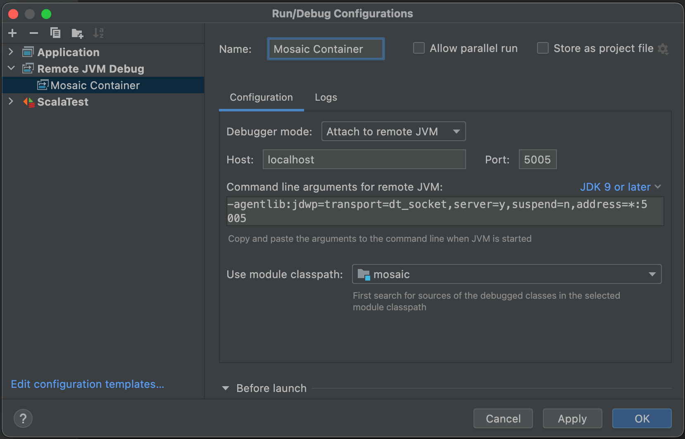
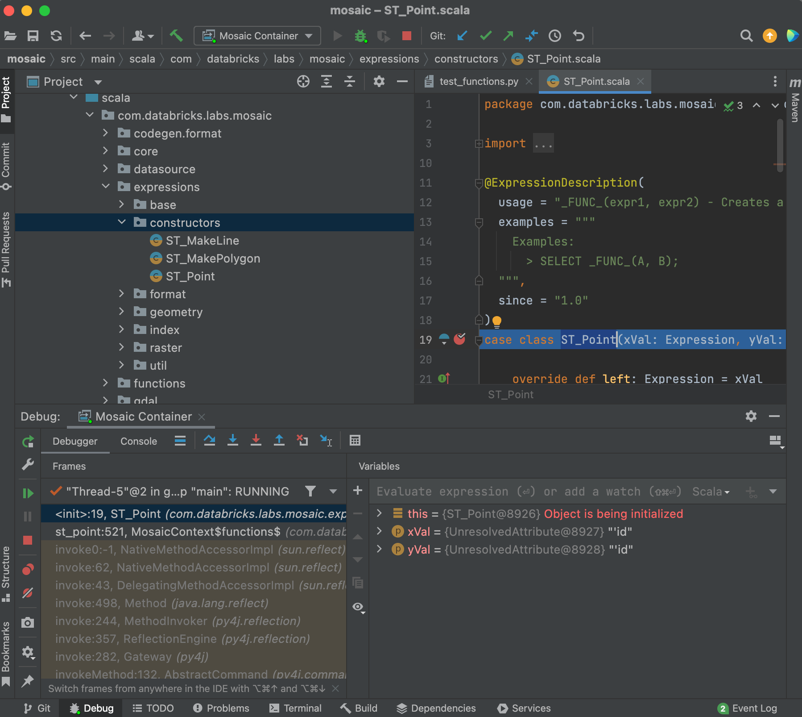

# Docker Image for Mosaic Development  

*Some ideas borrowed from [docker-openjdk-gdal](https://github.com/azavea/docker-openjdk-gdal/)*

This is a tool for creating a Docker image intended to support development of [Mosaic](https://github.com/databrickslabs/mosaic). Initial version was created to help with testing Mosaic components using GDAL (with Java bindings and IntelliJ remote debugging), but could/should potentially be extended to support other Mosaic features to help standardising the development/debugging environment.

An additional benefit of using this Docker image is ability to debug Scala code using IntelliJ's remote JVM debugging (even in Community Edition) without installing Spark libraries in the jar and using Python as a frontend. 


## Requirements

* Docker


## Usage

*Other template variables corresponding to additional libraries can/should be added as needed*

### Template variables

* `GDAL_VERSION` - Version number for GDAL installation (latest tested with: `3.4.0`)
* `OPENJDK_VERSION`- Base container image JDK version (latest tested with: `8`)
* `LIBRPOJ_VERSION` - Version number for Proj4 installation (latest tested with: `7.1.0`)
* `SPARK_VERSION` - Version number for Spark installation (latest tested with: `3.2.1`)
* `CORES` - Amount of cores used to build libraries


### Build

*Following was tested to work on MacOS (M1 and i9, it takes about 20-25 minutes to build), and may require some tweaking to work on other systems*

```
GDAL_VERSION=3.4.0 OPENJDK_VERSION=8 LIBPROJ_VERSION=7.1.0 SPARK_VERSION=3.2.1 CORES=4 ./build
```


### Test

1. Open a Terminal window ***in the directory containing the Mosaic code*** (or use a Terminal tool in the IntelliJ)

2. Run the following (this will mount the current directory to `/root/mosaic` in the container so it is important that it's executed in the directory containing Mosaic code)

```
docker run --name mosaic-dev --rm -p 5005:5005 -v $PWD:/root/mosaic -e JAVA_TOOL_OPTIONS="-agentlib:jdwp=transport=dt_socket,address=5005,server=y,suspend=n" -it mosaic-dev:jdk8-gdal3.4-spark3.2 /bin/bash
```

3. In the container prompt, run the following to build and run some Python code (e.g. one of the tests)

```
cd /root/mosaic
mvn clean package -DskipTests

cd python
pip install .
python3 -m unittest test.test_functions.TestFunctions.test_st_point
```

### Debug

In the IntelliJ IDE (also works in the Community edition)

1. Add a Remote JVM Debug configuration with default values



2. Set a breakpoint in some scala code which is invoked by your test code, (e.g. `src/main/scala/com/databricks/labs/mosaic/expressions/constructors/ST_Point` case class constructor used by the `test_st_point` executed earlier)

3. Run the test again in the container prompt, (e.g. `python3 -m unittest test.test_functions.TestFunctions.test_st_point`)

4. Quickly switch to IntelliJ IDE (easier if you are started the container in the IntelliJ Terminal) and hit the Debug button for the JVM Debug Configuration created in step 1

5. Code execution should drop into debugger when the breakpoint is hit

6. Repeat again if the execution finishes before you started the Debugger, or add more breakpoints if you suspect that code where you set the breakpoint is not executed




### Using Jupyter Notebook

To run Python code from a Jupyter Notebook (handy because it also allows geometry visualizations using `%mosaic_kepler` magic)

1. Start the container with an additional port mapping
```
docker run --name mosaic-dev --rm -p 5005:5005 -p 8888:8888 -v $PWD:/root/mosaic -e JAVA_TOOL_OPTIONS="-agentlib:jdwp=transport=dt_socket,address=5005,server=y,suspend=n" -it mosaic-dev:jdk8-gdal3.4-spark3.2 /bin/bash
```

2. In the container prompt, start the notebook server

```
cd /root/mosaic/python
pip install .

mkdir -p notebooks && cd notebooks

jupyter notebook --ip 0.0.0.0 --no-browser --allow-root
```

3. Copy the shown URL of the server including the token, e.g. `http://127.0.0.1:8888/?token=<some token value>`

4. Browse to that URL on your machine and create/use the notebooks to develop/debug some code (IntelliJ debugging still works). For a quick start, an [example notebook](sample_mosaic_playground.ipynb) is included here.


## Libraries

I noticed that at times downloading the libraries from the sources during the build takes long time, which can be a bit annoying if the build is run repeatedly. To counter that, I have pre-downloaded the libraries instead of downloading directly from the source every time. 

To achieve the same, all you need to do download the libraries locall and replace
```
RUN wget -qO- https://download.osgeo.org/gdal/${GDAL_VERSION}/gdal-${GDAL_VERSION}.tar.gz | \
    tar -xzC $ROOTDIR/src/

RUN wget -qO- https://download.osgeo.org/proj/proj-${LIBPROJ_VERSION}.tar.gz | \
    tar -xzC $ROOTDIR/src/
```

in the `Dockerfile.template` with

```
# Downloading these takes time, use locally downloaded version
COPY $CUR_DIR_NAME/gdal-${GDAL_VERSION}.tar.gz .
RUN tar -xf ./gdal-${GDAL_VERSION}.tar.gz -C $ROOTDIR/src/

COPY $CUR_DIR_NAME/proj-${LIBPROJ_VERSION}.tar.gz .
RUN tar -xf proj-${LIBPROJ_VERSION}.tar.gz -C $ROOTDIR/src/
```